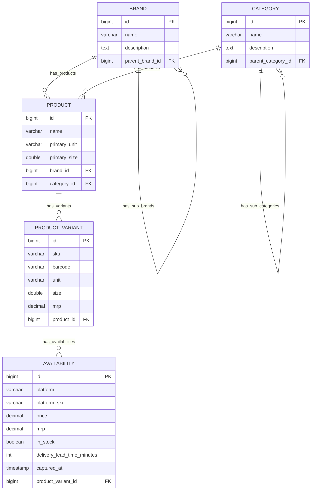

# GobbleCube — Catalog & Analytics Prototype

## Overview
This project is a prototype for **GobbleCube** to organize, manage, and analyze **crawled e-grocery product data** (Zepto, Blinkit, Flipkart Minutes, Swiggy Instamart, etc.).

It demonstrates:
- A **canonical catalog model** (Brands, Categories, Products, Variants, Availability).
- REST APIs for CRUD operations and analytics.
- A basic **React + Tailwind frontend** for browsing and analyzing the catalog.
- Seed data for **Unilever** with sub-brands like Dove, Lux, Lifebuoy, Surf Excel, Vaseline.

---

## Assumptions

1. **Crawled data is available:** The repository expects that raw crawling data has already been collected.
2. **Parsing & filtration pending:** Parsing and filtering of the raw data are not implemented here and will be handled in a later phase.
3. **Scope:** This codebase only contains the data storage design, supported operations, and cross-platform analytics — it does not include crawling, parsing, or filtration logic.

---

## Tech Stack

### Backend
- **Java 17**, **Spring Boot 3**
- **Gradle** (build tool)
- **MySQL** (persistent storage)
- **Hibernate / JPA** (ORM)

### Frontend
- **React (Vite)** single-page app
- **Tailwind CSS**
- Minimal custom router & API integration

---

## Features

- **Catalog CRUD APIs**
  - `/brands`, `/categories`, `/products`, `/variants`
  - Support for **parent/child brands** (Unilever → Dove, Lux, etc.)
  - Support for hierarchical categories

- **Analytics APIs**
  - Category coverage (variants per platform per category)
  - Price comparison across platforms
  - Gap analysis (products on one platform but missing on another)

- **Search APIs**
  - Full-text & filterable search by name, brand, category

- **Frontend**
  - Dashboard showing brands, categories, and quick actions
  - Browse **brands → sub-brands → products → variants**
  - Search products
  - Analytics tab: category coverage & gap analysis

---

## Entity Model

### ER Diagram

## DB ScreenShots
- **Tables**
  

- **Brand**
  

- **Categories**
  

- **Product**
  

- **Product_Varients**
  

- **Availability**
  

